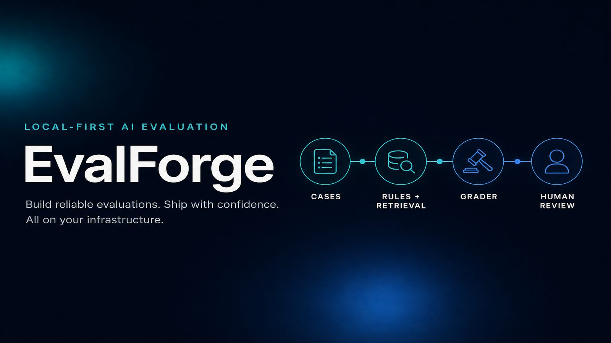
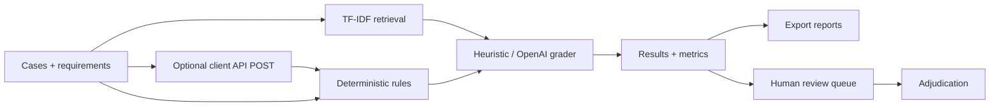

<p align="center">
  
</p>

<h1 align="center">EvalForge</h1>

<p align="center">
  <strong>Local-first AI evaluation engineering</strong><br>
  Build repeatable benchmarks. Ground graders in approved evidence.<br>
  Catch instruction failures deterministically. Route uncertainty to humans.
</p>

<p align="center">
  <a href="#quick-start"></a>
  <a href="#why-evalforge"></a>
  <a href="LICENSE"></a>
  <a href="#stack"></a>
  <a href="#stack"></a>
  <a href="#tests"></a>
</p>

<p align="center">
  <a href="#quick-start">Quick start</a> ·
  <a href="#demo-in-60-seconds">Demo</a> ·
  <a href="#what-you-get">Features</a> ·
  <a href="#architecture">Architecture</a> ·
  <a href="#api-overview">API</a> ·
  <a href="#limitations">Limitations</a>
</p>

---

## Why EvalForge?

Most AI demos grade models with another model and call it done.

EvalForge treats evaluation like **engineering**:

| Problem in the wild | What EvalForge does |
|---|---|
| Prompt regressions are hard to reproduce | Versioned cases, runs, and immutable config snapshots |
| LLM judges invent confidence | Deterministic rules first; LLM grader is optional |
| "Unsupported" gets treated as "false" | Explicit claim verdicts + human review queue |
| Evidence lives in someone's chat history | Local TF-IDF retrieval over approved documents |
| Teams cannot audit why a grade happened | Rule findings, evidence IDs, claim verdicts, exports |

**Positioning:** an engineering workbench for evaluation — not a production truth engine.

Built for portfolio depth in **AI evaluation**, **RAG grounding**, **human-in-the-loop review**, and **local-first product design**.

---

## Demo in 60 seconds

```bash
python -m venv .venv
# Windows: .venv\Scripts\Activate.ps1
# macOS/Linux: source .venv/bin/activate
pip install -r requirements.txt
uvicorn app.main:app --reload
```

Open [http://localhost:8000](http://localhost:8000) → create a project → **Load sample data** → run the offline heuristic grader.

You get:

1. An accounting reference document retrieved locally  
2. Three evaluation cases with expected labels  
3. Deterministic format checks + evidence-backed claim signals  
4. Metrics, exportable reports, and a human-review queue for weak evidence  

Or with Docker:

```bash
cp .env.example .env
docker compose up --build
```

---

## What you get

### Core loop
- **Projects** — separate benchmarks and evidence collections
- **Reference documents** — approved local evidence for retrieval
- **Evaluation cases** — prompt, candidate response, expected label, requirements
- **Runs** — repeatable offline heuristic grading or optional OpenAI structured grading
- **Metrics** — accuracy, precision/recall/F1, confusion matrix when labels exist

### v0.2 capabilities
- **CSV / JSONL import** — dry-run, atomic, or partial modes (up to 10k cases)
- **Report export** — JSON, JSONL, CSV with review / label / incorrect filters
- **Deterministic graders** — words, sentences, phrases, regex, JSON Schema, citations, Python/`ast` syntax, conservative SQL checks, and more
- **Human review** — multi-reviewer decisions, disagreement preservation, adjudication
- **Config snapshots** — provider, model, prompt version, retrieval settings, Git SHA, app version per run

### v0.3 client API runner
- **Per-project API target** — POST URL, JSON body template with `{{prompt}}`, response field path, timeout
- **Auth via environment variables** — store only the env-var *name*; never the secret value
- **Batch execution** — every case is called; one failure does not stop the rest
- **Per-case telemetry** — response text, latency, HTTP status, and redacted errors
- **Heuristic grading** on successful responses; failed calls are recorded and queued for review

### Product principles
- Local-first by default  
- Deterministic checks never call an LLM  
- OpenAI is used only when explicitly selected  
- Unsupported ≠ false  
- Humans adjudicate uncertain / high-risk outcomes  
- Client API secrets never appear in API responses, UI, logs, or stored JSON  

---

## Architecture

```text
Evaluation cases
      │
      ├── client API runner (optional POST {{prompt}})
      │
      ├── deterministic rule checks
      │
      └── local retrieval over approved documents
                    │
                    ▼
       heuristic or structured LLM grader
                    │
                    ▼
 claims + evidence + severity + confidence
                    │
                    ▼
 metrics · exports · review queue · adjudication
```



---

## Stack

| Layer | Choice |
|---|---|
| API | FastAPI |
| Validation | Pydantic |
| Storage | SQLite (local, WAL) |
| Retrieval | scikit-learn TF-IDF |
| Optional LLM grader | OpenAI Responses API + structured output |
| UI | Minimal vanilla JS (no heavy frontend framework) |
| Packaging | Docker Compose |
| Tests | pytest |

---

## Quick start

Requires **Python 3.11+**.

```bash
python -m venv .venv
```

```bash
# Windows PowerShell
.venv\Scripts\Activate.ps1

# macOS / Linux
source .venv/bin/activate
```

```bash
pip install -r requirements.txt
uvicorn app.main:app --reload
```

Optional OpenAI grader:

```bash
cp .env.example .env   # PowerShell: Copy-Item .env.example .env
```

Set `OPENAI_API_KEY`, restart, and choose **OpenAI structured grader** in the UI.

### Client API runner (v0.3)

1. Copy `.env.example` → `.env` and set a token env var, e.g. `CLIENT_API_TOKEN=...`
2. Create a project and add (or import) evaluation cases — prompts are required; placeholder responses are fine
3. In the UI **Client API target** panel (or `PUT /api/projects/{id}/api-target`), configure:
   - URL (`http`/`https` only)
   - Body template JSON containing `{{prompt}}`
   - Response field path (e.g. `data.answer`)
   - Timeout seconds (default 30)
   - Auth header name + **env var name** (not the secret)
4. Choose provider **Client API runner** and start a run
5. Inspect per-case HTTP status, latency, extracted text, and errors; successful responses update the case candidate text and are graded offline

```bash
curl -X PUT "http://localhost:8000/api/projects/1/api-target" \
  -H "Content-Type: application/json" \
  -d "{\"url\":\"http://127.0.0.1:9000/generate\",\"body_template\":\"{\\\"input\\\": \\\"{{prompt}}\\\"}\",\"response_field_path\":\"data.answer\",\"timeout_seconds\":30,\"auth_header\":\"Authorization\",\"auth_env_var\":\"CLIENT_API_TOKEN\"}"

curl -X POST "http://localhost:8000/api/projects/1/runs" \
  -H "Content-Type: application/json" \
  -d "{\"provider\":\"client_api\",\"model\":\"client-api\",\"top_k\":4}"
```

### Tests

```bash
pytest -q
```

---

## Examples that recruiters can skim

### Import cases

```bash
curl -X POST "http://localhost:8000/api/projects/1/cases/import" \
  -F "file=@examples/accounting_cases_v02.jsonl" \
  -F "dry_run=false" \
  -F "atomic=true"
```

Sample fixtures:

- [`examples/accounting_cases_v02.jsonl`](examples/accounting_cases_v02.jsonl)
- [`examples/accounting_cases.csv`](examples/accounting_cases.csv)
- [`examples/grader_config.json`](examples/grader_config.json)
- [`examples/accounting_reference.md`](examples/accounting_reference.md)

### Export a run

```bash
curl -L "http://localhost:8000/api/runs/1/export?format=json" -o run.json
curl -L "http://localhost:8000/api/runs/1/export?format=jsonl&review_required=true" -o review.jsonl
curl -L "http://localhost:8000/api/runs/1/export?format=csv&predicted_label=major" -o major.csv
```

### Review workflow

1. Run evaluation → weak evidence sets `needs_human_review`
2. Open the UI review queue or `GET /api/reviews`
3. Reviewers submit labels via `POST /api/reviews/{result_id}/decisions`
4. Disagreement is preserved as `DISAGREEMENT`
5. Adjudicator finalizes via `POST /api/reviews/{result_id}/adjudicate`

States: `PENDING` → `REVIEWED` → `DISAGREEMENT` → `ADJUDICATED`

---

## API overview

Interactive docs: [http://localhost:8000/docs](http://localhost:8000/docs)

| Method | Endpoint | Purpose |
|---|---|---|
| GET | `/api/health` | Health check |
| GET/POST | `/api/projects` | List / create projects |
| GET | `/api/projects/{id}` | Project detail |
| POST | `/api/projects/{id}/documents` | Add evidence |
| POST | `/api/projects/{id}/cases` | Add a case |
| POST | `/api/projects/{id}/cases/batch` | JSON batch create |
| POST | `/api/projects/{id}/cases/import` | CSV / JSONL import |
| POST | `/api/projects/{id}/seed` | Load sample benchmark |
| PUT | `/api/projects/{id}/api-target` | Configure client API target |
| POST | `/api/projects/{id}/runs` | Execute evaluation |
| GET | `/api/runs/{id}` | Run detail |
| GET | `/api/runs/{id}/export` | Download report |
| GET | `/api/reviews` | Review queue |
| POST | `/api/reviews/{result_id}/decisions` | Submit decision |
| POST | `/api/reviews/{result_id}/adjudicate` | Final adjudication |

Import limits (env-configurable):

| Variable | Default |
|---|---|
| `EVAL_MAX_IMPORT_CASES` | `10000` |
| `EVAL_MAX_IMPORT_FILE_BYTES` | `20971520` (20 MB) |

---

## Database notes

SQLite schema is created with `CREATE TABLE IF NOT EXISTS`, then upgraded non-destructively by `migrate_schema()` on startup.

1. Stop the server  
2. Back up `./data/evals.db`  
3. Upgrade code / dependencies  
4. Start the server — columns and indexes are added safely  
5. Do not delete the DB unless you intentionally reset (`make clean`)

---

## Limitations

EvalForge is an **engineering platform**, not a production oracle.

1. Offline factuality is heuristic — lexical overlap ≠ real-world truth  
2. **Unsupported is not false**  
3. LLM graders are not authoritative — calibrate with human gold labels  
4. Human adjudication is required for uncertain or high-risk decisions  
5. SQL syntax checks are conservative and never execute SQL  
6. TF-IDF retrieval is intentionally simple  
7. No auth, multi-tenant isolation, async workers, or rate limiting yet  
8. Runs are synchronous  
9. Client API runner supports **POST only** in v0.3  
10. **SSRF:** URL validation requires `http`/`https` with a hostname and rejects embedded credentials. Loopback and private addresses are allowed for local-first demos. Do not expose EvalForge to untrusted users without egress controls — a configured target can reach internal network hosts  

### Security

- Do not send confidential assessment content to OpenAI unless policy allows it  
- Imports reject bad extensions, enforce size limits, sanitize filenames, and never execute uploads  
- Keep secrets in `.env` — never commit them  
- Client API auth: store only the environment-variable **name** on the project; the secret value is read at request time and redacted from errors/stored payloads  

---

## Roadmap hints

- Inter-annotator agreement metrics  
- Embedding retrieval + citation entailment  
- Async workers, cost/token tracking, tracing  
- RBAC, audit hashing, dataset versioning, CI regression gates  

---

## Why this repo is portfolio-ready

- End-to-end product: API + UI + Docker + tests + docs  
- Clear evaluation philosophy (deterministic → retrieval → optional LLM → humans)  
- Audit-friendly artifacts (config snapshots, exports, review decisions)  
- Honest limitations instead of hype  

If you are hiring for **AI evaluation / LLMOps / applied RAG**, this is designed to show systems thinking — not just a chat wrapper.

---

## License

Copyright (c) 2026 Kozphy. All rights reserved. This project is proprietary; viewing the repository does not grant permission to copy, modify, distribute, or reuse its contents. See the [proprietary license](LICENSE).
