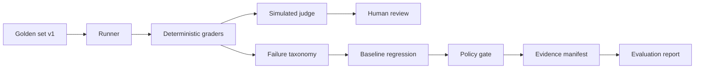

# EvalForge

**Problem:** Financial AI can produce plausible but materially incorrect outputs — wrong equity math, unbalanced journals, cash confused with profit, fabricated standards, or unsupported audit conclusions.

**Solution:** A reproducible evaluation pipeline combining deterministic checks, optional LLM judging, human review, regression testing, policy gates, and audit evidence for finance, accounting, and coding-adjacent LLM tasks.

| | |
|---|---|
| Benchmark | **154** original items · `finance-accounting-v1` |
| Offline candidate accuracy | **79.9%** vs gold baseline **100%** |
| Policy decision | **FAIL** (`critical_error_rate > 0.05`) |
| Grader catches planted errors | **31/31** valid cases, 0 false alarms (synthetic, self-authored) |
| Tests | **71** pytest |

All numbers are **local benchmarks on synthetic data** — no production use, no real-model results.
What is and is not proven: [`docs/portfolio-positioning.md`](docs/portfolio-positioning.md) · verified run: [`docs/end-to-end-flow.md`](docs/end-to-end-flow.md)

```bash
python -m venv .venv && .venv\Scripts\Activate.ps1   # or source .venv/bin/activate
pip install -r requirements.txt
python -m finance_eval run --mode gold --write-baseline
python -m finance_eval run --mode candidate
python -m finance_eval report
pytest -q
```

Full report: [`docs/reports/finance-evaluation-report.md`](docs/reports/finance-evaluation-report.md)  
Audit: [`docs/architecture/finance-eval-audit.md`](docs/architecture/finance-eval-audit.md)

---

## Evaluation lifecycle

```text
Finance / Accounting Dataset
 → Golden Set
 → Model Runner (offline fixture or custom response_fn)
 → Deterministic Evaluation
 → LLM-as-a-Judge (simulated offline; never sole truth)
 → Human Review (seeded subset)
 → Failure Taxonomy (FIN-*)
 → Regression Testing (vs gold baseline)
 → Policy Gate (PASS / WARN / FAIL / HUMAN_REVIEW_REQUIRED)
 → Audit Evidence (JSON/JSONL + hashes)
 → Final Evaluation Report
```



### Sample measured results (offline candidate fixture)

| Metric | Gold baseline | Candidate | Delta |
|---|---:|---:|---:|
| Accuracy | 100% | 79.9% | −20.1pp |
| Critical error rate | 0% | 5.2% | +5.2pp |
| Hallucination rate | 0% | 0.6% | +0.6pp |
| Policy | PASS | **FAIL** | blocked |

**Example failures:** `FIN-CALC-001` arithmetic, `FIN-JE-011` unbalanced entry, `FIN-REV-010` revenue timing, `FIN-HALL-006` fabricated fact, `FIN-SQL-007` wrong aggregation.

**Example policy:** `FIN-POL-001` — if `critical_error_rate > 0.05` → **FAIL** deployment.

---

## What is implemented vs labeled

| Layer | Status |
|---|---|
| Finance golden set (154) + generator | **Implemented** |
| Deterministic graders + taxonomy | **Implemented** |
| Offline runner + metrics + bootstrap CI | **Implemented** |
| Regression vs baseline + policy gate | **Implemented** |
| File-append evidence manifests | **Implemented** |
| LLM-as-judge | **Simulated** offline (hook shape only) |
| Human reviews | **Curated seed** (not a production queue UI) |
| Live multi-model API runner | **Implemented** (OpenAI/Anthropic/mock; cost cap + retries) |
| EvalForge workbench + control plane | **Implemented** separately (v0.5 operator console) |

### Live model evaluation (P0)

```bash
# Offline CI-safe path (mock provider — no API keys)
python -m finance_eval run --mode live --provider mock --limit 10 --max-cost-usd 1

# Real OpenAI (requires OPENAI_API_KEY in env — never commit secrets)
python -m finance_eval run --mode live --provider openai --live-model gpt-4o-mini --limit 20 --max-cost-usd 1.0

# Real Anthropic (requires ANTHROPIC_API_KEY)
python -m finance_eval run --mode live --provider anthropic --live-model claude-3-5-haiku-latest --limit 20 --max-cost-usd 1.0
```

Writes a **redacted** metrics-only summary to `finance_eval/baselines/live_run_summary.example.json` (no prompts/responses). Costs are **estimated** from a static price table, not invoices.

---

## Package layout

```text
finance_eval/
  dataset/finance_accounting_v1.jsonl   # frozen golden set
  dataset/MANIFEST.json                 # version + sha256
  baselines/baseline_metrics.json       # gold oracle baseline
  taxonomy.py  graders.py  runner.py  policy.py  evidence.py  report.py
```

Deterministic evaluation is authoritative. Judges never override failing deterministic checks in CI.

---

## Operator console & workbench (existing product)

The broader EvalForge app remains available:

```bash
uvicorn app.main:app --reload
```

- `/` — Evaluation Control Plane operator console (demo fixture journey)
- `/workbench` — local SQLite evaluation workbench

Do not confuse the **customer-support operator demo** with the **finance-accounting-v1** benchmark evidence above.

---

## Job mapping (portfolio)

| Role | Credible today? | Strongest artifact |
|---|---|---|
| Finance AI Evaluator | **Yes (portfolio)** | Golden set + failure taxonomy + report |
| LLM Evaluation Engineer | **Yes** | Runner / policy / evidence layers + tests |
| AI Governance Engineer | **Partial** | Policy FAIL on critical finance errors + manifests |
| Coding Evaluator | **Partial** | SQL/Python result fixtures (not sandboxed exec) |
| Finance AI Trainer | **Weak** | Dataset only — no training loop |
| LLM Evaluator | **Yes** | Deterministic-first + judge/human disagreement tracking |

Details: [`docs/architecture/finance-eval-job-mapping.md`](docs/architecture/finance-eval-job-mapping.md)

---

## Limitations

- Offline candidate uses planted errors for reproducibility — not a blind live-model study.
- No production adoption claimed.
- SQL/Python checks grade numeric results / structure, not arbitrary code execution sandboxes.
- Human reviews are seeded for agreement demo.

---

## License

Proprietary — see [LICENSE](LICENSE).
