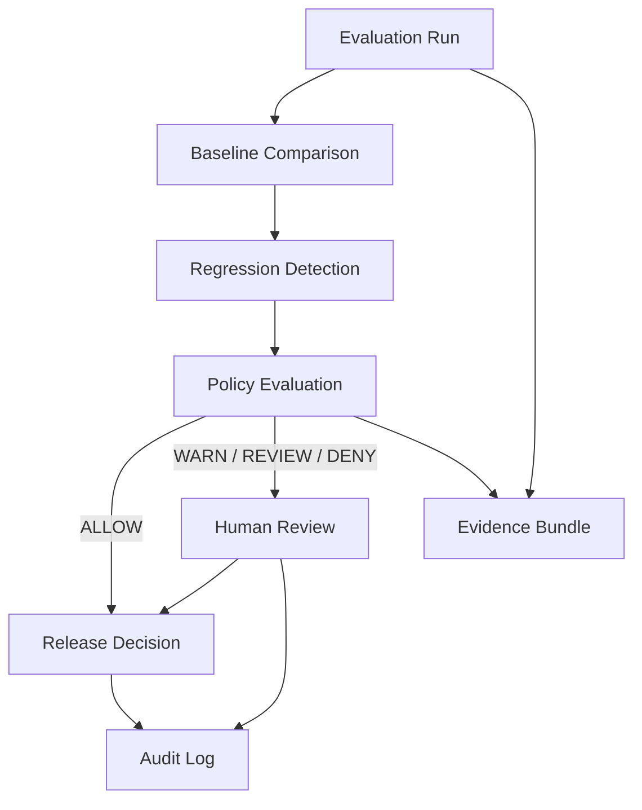

<p align="center">
  
</p>

<h1 align="center">EvalForge</h1>

<p align="center">
  <strong>EvalForge is an AI Evaluation Control Plane for governing model and application releases through reproducible evaluation, regression detection, policy gates, evidence, and human review.</strong>
</p>

<p align="center">
  <a href="#operator-console-demo"></a>
  <a href="#maturity"></a>
  <a href="LICENSE"></a>
  <a href="#stack"></a>
  <a href="#stack"></a>
  <a href="#tests"></a>
</p>

<p align="center">
  <a href="#operator-console-demo">Demo</a> ·
  <a href="#evaluation-lifecycle">Lifecycle</a> ·
  <a href="#architecture">Architecture</a> ·
  <a href="#maturity">Maturity</a> ·
  <a href="#limitations">Limitations</a>
</p>

---

## What this is

An **operator-facing Evaluation Control Plane** — not a marketing site and not a claim of production adoption.

Within ~30 seconds an engineer, governance reviewer, platform owner, or risk reviewer should answer:

1. What system/model is evaluated?
2. What dataset / suite was used?
3. What changed vs baseline?
4. Which metrics improved or regressed?
5. Did the candidate pass release policy?
6. Why allow / warn / review / deny?
7. What evidence supports the decision?
8. Can the decision be reproduced later?
9. Does a human need to approve?
10. What happened historically?

**Primary UI:** dense enterprise console at `/`  
**Legacy workbench:** local-first grader at `/workbench`

---

## Evaluation lifecycle

```text
Evaluation → Baseline → Regression → Policy Decision → Release Gate → Evidence → Human Review → Audit Trail
```



| Control boundary | Status |
|---|---|
| Reproducible evaluation runs | **Implemented** (CP + demo fixture overlay) |
| Baseline registry | **Implemented** (in-memory CP; UI read-only promote) |
| Regression engine | **Implemented** |
| Policy gates (ALLOW/WARN/REVIEW/DENY) | **Implemented** |
| Evidence artifacts + redaction | **Implemented** |
| Human approval queue | **Prototype** (fixture-backed; CI cannot self-approve) |
| Append-only durable audit | **Simulated** in operator demo; CP emits manifests |
| Durable CP repositories | **Planned** |

---

## Operator console demo

```bash
python -m venv .venv
# Windows: .venv\Scripts\Activate.ps1
# macOS/Linux: source .venv/bin/activate
pip install -r requirements.txt
uvicorn app.main:app --reload
```

Open **[http://localhost:8000](http://localhost:8000)**.

### Coherent demo scenario (`demo_fixture`)

| Field | Value |
|---|---|
| Candidate | `customer-support-agent-v12` |
| Baseline | `customer-support-agent-v11` |
| Run ID | `run_cs_agent_v12_001` |
| Accuracy / latency | improved |
| Groundedness | regressed (high) |
| Hallucination rate | exceeded threshold (critical) |
| Policy | **REVIEW** (`P-014`, `P-021`) |
| Human approval | **PENDING** |

Trace the same IDs across:

**Overview → Evaluation Runs → Run Detail → Regressions → Policy Gates → Evidence → Approvals → Audit Log**

Reset anytime: **Reset demo** in the header, or `POST /api/operator/demo/reset`.

Screenshots:

- [`docs/assets/operator-console-overview.png`](docs/assets/operator-console-overview.png)
- [`docs/assets/operator-console-run-detail.png`](docs/assets/operator-console-run-detail.png)

CI also runs:

```bash
pytest -q
python scripts/check_operator_console.py
```

---

## Architecture

```text
Browser (vanilla operator console)
        │  /api/operator/*
        ▼
Operator service  ──demo_fixture──► coherent journey world
        │ overlay (optional)
        ▼
Control plane domain
  orchestrator · baselines · regression · policy · evidence · audit manifest
        │
        ├── /api/control-plane/*  (live CP APIs)
        └── SQLite workbench      (/workbench legacy product)
```

| Layer | Choice |
|---|---|
| API | FastAPI + Pydantic |
| CP storage | In-memory (not durable) |
| Workbench storage | SQLite WAL |
| UI | Vanilla JS/CSS — no React/Vite required |
| Tests | pytest + operator HTTP/UI path tests |
| Packaging | Docker Compose |

Frontend layout: `app/static/{index.html,operator.js,operator.css}` with API access isolated in `OperatorAPI`. Backend adapters: `app/control_plane/operator_service.py` + `operator_fixtures.py`.

Audit before UI: [`docs/architecture/operator-ui-audit.md`](docs/architecture/operator-ui-audit.md)  
Post-implementation: [`docs/architecture/operator-ui-deliverables.md`](docs/architecture/operator-ui-deliverables.md)

---

## Navigation (operator console)

| Module | Maturity |
|---|---|
| Overview | **Implemented** (fixture + live overlay counts) |
| Evaluation Runs / Detail | **Implemented** |
| Baselines | **Read-only** UI; promote is typed future mutation |
| Regressions | **Implemented** |
| Policy Gates | **Implemented** (+ raw YAML advanced panel) |
| Evidence | **Implemented** |
| Approvals | **Prototype** |
| Audit Log | **Simulated** demo events + CP overlay when present |
| Research / Benchmarks | **Implemented** (surfaces research assets) |
| Settings | **Implemented** (maturity labels, links) |

---

## Control-plane CLI (still available)

```bash
python -m app.control_plane.cli experiment run examples/control_plane_demo/experiment.yaml --demo --seed-baseline production
python -m app.control_plane.cli evaluators health
```

Docs: [`docs/architecture/control-plane.md`](docs/architecture/control-plane.md)

---

## Legacy workbench

The original local-first evaluation workbench remains at **[/workbench](http://localhost:8000/workbench)**:

- Projects, reference docs, cases, heuristic/OpenAI graders
- CSV/JSONL import, exports, human review adjudication
- Optional client API runner

This is a separate product surface from the control-plane operator console.

---

## Stack

| Layer | Choice |
|---|---|
| API | FastAPI |
| Validation | Pydantic |
| Storage | SQLite (workbench) + in-memory CP |
| Retrieval | scikit-learn TF-IDF |
| Optional LLM grader | OpenAI Responses API |
| UI | Vanilla JS operator console |
| Packaging | Docker Compose |
| Tests | pytest |

---

## Quick start (Docker)

```bash
cp .env.example .env
docker compose up --build
```

---

## API overview (operator)

| Method | Path | Notes |
|---|---|---|
| GET | `/api/operator/overview` | Release-readiness card + KPIs |
| GET | `/api/operator/runs` | Filterable run list |
| GET | `/api/operator/runs/{id}` | Metrics, regressions, policy, chain |
| GET | `/api/operator/baselines` | Baseline registry |
| GET | `/api/operator/regressions` | Degradation analysis |
| GET | `/api/operator/policy` | Decision + timeline + raw config |
| GET | `/api/operator/evidence` | Evidence artifacts |
| GET/POST | `/api/operator/approvals` | Queue + prototype decisions |
| GET | `/api/operator/audit` | Audit events |
| GET | `/api/operator/research` | Benchmark/research summary |
| POST | `/api/operator/demo/reset` | Reset coherent fixture |

Live CP routes under `/api/control-plane/*` remain unchanged.

---

## Tests

```bash
pytest -q
python scripts/check_operator_console.py
```

Operator tests cover: overview/release card, run→policy chain, evidence linkage, approval self-approve guard, empty filters, 404, console HTML serving.

---

## Maturity

Do **not** treat this as production-proven enterprise SaaS. Ratings are evidence-based:

| Dimension | Rating | Notes |
|---|---|---|
| Product UX maturity | **Partial → credible demo** | Full nav + run detail decision chain; fixture-backed coherence |
| Software engineering maturity | **Solid** | Contracts, tests, CI, typed adapters, clear maturity labels |
| AI evaluation maturity | **Partial** | Real CP engines; operator journey uses labeled demo data |
| Governance maturity | **Partial / prototype** | Policy inspectable; human approval is prototype control boundary |
| Reliability maturity | **Early** | CP in-memory; no durable operator audit store |
| Production evidence maturity | **Early** | No customer production adoption claimed |

---

## Limitations

- Operator KPIs are **demo_fixture** unless a live CP overlay is present — never fabricated as production metrics.
- Control-plane stores are **ephemeral** (process memory).
- Approval decisions are **prototype** and reset with the demo world.
- Audit log UI does not claim cryptographic immutability.
- Baseline promotion is **not** writable from the UI yet.
- Research page surfaces existing research assets; it is not a paper viewer.

---

## License

Proprietary — see [LICENSE](LICENSE).
