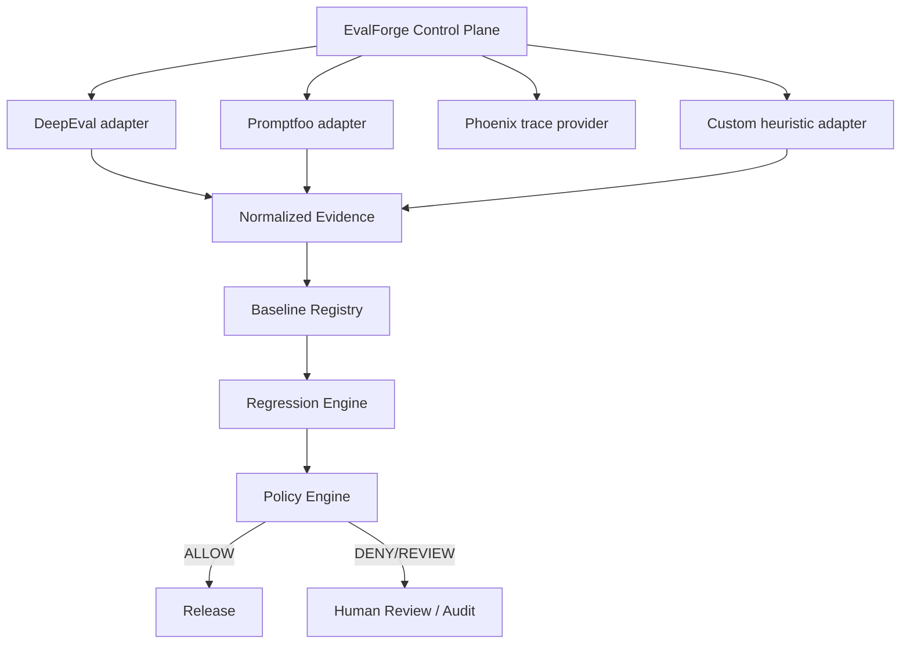

# Evaluation Control Plane

## Implemented (v0.4)

- Canonical contracts + schema version
- Adapter registry + custom/DeepEval/Promptfoo adapters (optional) + fakes
- Phoenix `TraceProvider` interface (optional)
- Experiment spec + orchestrator
- Baseline registry, regression engine, policy engine
- Evidence store + redaction + audit manifest
- CLI + control-plane API endpoints
- Deterministic end-to-end demo

## Experimental

- Live DeepEval / Promptfoo execution (intentionally gated; CI uses fakes)
- In-memory stores (not yet durable SQLite repositories for all CP entities)

## Planned

- Durable repository implementations on SQLite/Postgres
- Full retry worker / dead-letter processing
- OpenTelemetry metrics export
- Stronger dataset immutability / golden-set registry
